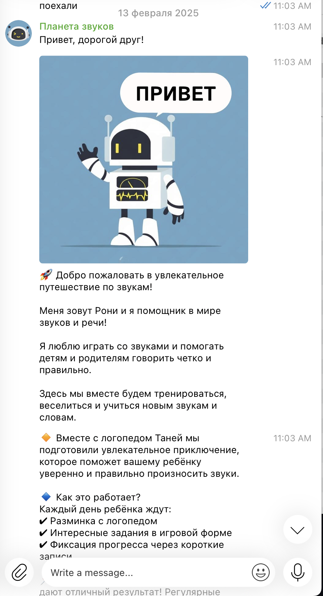

# 🚀 Sound Planet

## Overview

**Sound Planet** is a gamified Telegram bot designed to help children practice speech therapy exercises through an engaging space adventure.

Instead of receiving repetitive homework, children become astronauts on a mission to restore the power of the Russian sound **"Р"**. Each day unlocks a new planet, a new challenge, and a new speech exercise.

The project combines speech therapy techniques, storytelling, gamification, and conversational UX to increase motivation and daily practice consistency.

---

## Problem

Speech therapy exercises often require regular repetition outside of sessions with a specialist.

Many children:

* lose motivation after a few days;
* perceive exercises as boring homework;
* skip daily practice;
* need additional support between speech therapy sessions.

Parents also need a simple and engaging way to keep children involved in the process.

---

## Solution

Sound Planet transforms daily speech exercises into a 16-day space mission.

Children travel through a fictional universe together with **Roni**, a friendly robot guide.

During the journey they:

* complete articulation warm-ups;
* practice pronunciation of the sound "Р";
* send audio recordings;
* unlock new story chapters;
* receive positive reinforcement and progress feedback.

---

## Key Features

### 🎮 Gamified Learning

Speech exercises are embedded into a continuous story.

### 🤖 Conversational Interface

All interactions happen naturally inside Telegram.

### 🎙 Audio Practice

Children record their pronunciation directly in the chat.

### 🚀 Daily Missions

Short exercises designed to take approximately 5 minutes per day.

### 📈 Progress Tracking

The bot encourages consistency and celebrates achievements.

### 🪐 Storytelling System

Each day reveals a new location and a new mission.

---

## Screenshots

### Welcome Screen

### Mission Introduction

### Daily Exercises

### Interactive Practice

### Scenario Architecture

---

## Technology Stack

* Telegram Bot
* SaleBot
* Conversational Design
* UX Writing
* Educational Content Design
* Gamification
* No-Code Automation

---

## My Role

This project was designed and assembled end-to-end.

Responsibilities included:

* Product concept development
* User journey design
* Conversational UX
* Storytelling and narrative design
* Educational content structure
* Gamification mechanics
* Scenario architecture
* SaleBot implementation
* Testing and iteration

---

## Results

The project demonstrates how educational content can be transformed into an engaging interactive experience through conversational interfaces and game mechanics.

The focus was not only on delivering exercises but on creating a daily habit and maintaining children's motivation throughout the entire learning journey.

---

## Key Learnings

Through this project I explored:

* conversational product design;
* gamification for education;
* engagement loops for children;
* educational content structuring;
* no-code automation systems;
* designing long-term user motivation.

